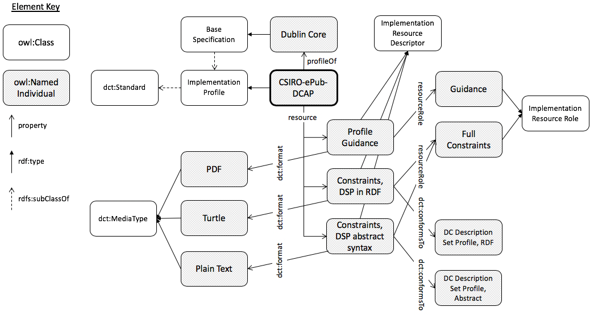

# CSIRO ePublish Dublin Core Application Profile

This is a dummy profile of a set of vocabularies ([Dublin Core Terms](http://www.dublincore.org/documents/dcmi-terms/), [FOAF](http://xmlns.com/foaf/spec/) principally but those they utilise and others too) constructed as a
[Dublin Core Application Profile](http://dublincore.org/documents/profile-guidelines/).

The purpose of creating this dummy profile is to test the power of the
[Profile Description Ontology](https://w3c.github.io/dxwg/profiledesc/) at
representing a particular community's - the Dublin Core community - method of
profile creation.

This dummy has been created during the operations of the [W3C](https://www.w3.org/)'s
[Dataset Exchange Working Group](https://www.w3.org/2017/dxwg/) by members of
that Working Group.

## Dataset contents
This profile is presented as a Linked Data dataset. It consists of only four
data files:

1. **[profiledesc.ttl](profiledesc.ttl)** - a description of the dummy CSIRO ePublish according to the Profile Description Ontology
2. **[profiledesc.png](profiledesc.png)** - a visual representation of 1., also shown below
3. **[constraints-dcap-syntax.txt](constraints-dcap-syntax.txt)** - dummy constraints of the profile written according to the DCAP Description Set Profile (DSP) syntax
4. **[constraints.ttl](constraints.ttl)** - the DSP in RDF (turtle), formulated according to <http://dublincore.org/documents/dc-dsp/>

### Visual representation of the profile description
  
**Figure 1**: The file 2. above.

## License
The content of this API is licensed for use under the [Creative Commons 4.0 License](https://creativecommons.org/licenses/by/4.0/). See the [license deed](LICENSE) all details.

## Contacts
*Dataset Author:*  
**Nicholas Car**  
CSIRO Land & Water  
<nicholas.car@csiro.au>
