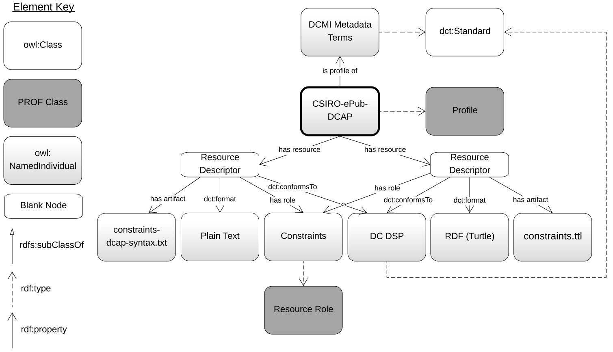

# CSIRO ePublish Dublin Core Application Profile

This is a dummy *profile* of a set of vocabularies, principally ([Dublin Core Terms](http://www.dublincore.org/documents/dcmi-terms/) &
[FOAF](http://xmlns.com/foaf/spec/) but others that those they utilise, such as [RDFS](https://www.w3.org/TR/rdf-schema/).
This profile is constructed as a [Dublin Core Application Profile](http://dublincore.org/documents/profile-guidelines/)
which constrains the vocabulary terms used.

The various parts of this profile - the constraints, this descriptive document etc. - are described using the
[Profiles Ontology](https://w3c.github.io/dxwg/profilesont/).

This dummy has been created during the operations of the [W3C](https://www.w3.org/)'s
[Dataset Exchange Working Group](https://www.w3.org/2017/dxwg/) by members of that Working Group.

## Profile contents
This profile is presented as a Linked Data definitional resource. It consists of four main files:

1. **this file** - the profile overview
2. **[HowTo.pdf](HowTo.pdf)** - a guidance document describing how to create records using this profile and submit them to the CSIRO ePublish Repository
3. **[profile.ttl](profile.ttl)** - a description of the dummy CSIRO ePublish Repository profile according to the Profile Description vocabulary  in RDF (turtle)
4. **[csiro-dummy-dcap.svg](csiro-dummy-dcap.svg)** - a visual representation of 3., also shown below, which is of the profile elements according to the [Profiles Ontology](https://w3c.github.io/dxwg/profilesont/)
5. **[constraints-dcap-syntax.txt](constraints-dcap-syntax.txt)** - dummy constraints of the profile written according to the DCAP Description Set Profile (DSP) syntax
6. **[constraints.ttl](constraints.ttl)** - the DSP in RDF (turtle), formulated according to <http://dublincore.org/documents/dc-dsp/>

### Visual representation
  
**Figure 1**: The file 4. above.

## Instances
Several instances of dummy resources implementing this profile are given in RDF (turtle) in the [instances.ttl](instances.ttl) file and repeated in Microsoft Excel [instances.xlsx](instances.xlsx) allowing for comparison.

## License
The content of this API is licensed for use under the [Creative Commons 4.0 License](https://creativecommons.org/licenses/by/4.0/). See the [license deed](LICENSE) all details.

## Contacts
*Author:*  
**Nicholas Car**  
CSIRO Land & Water, Environmental Informatics Group  
<nicholas.car@csiro.au>
